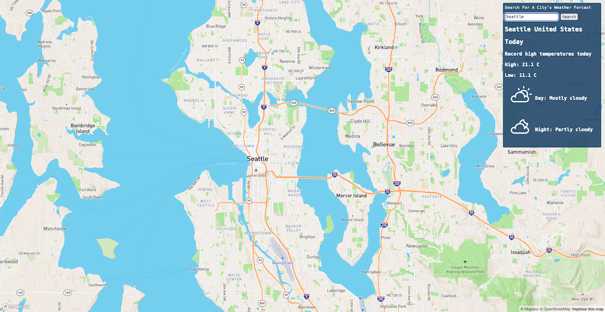
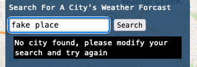

# Integrify-Weather

## LIVE SITE: [VIEW](https://clinquant-crumble-c3992b.netlify.app)

---

## PLEASE NOTE:

Free tier AccuWeather API accounts _**limit the total number of daily calls to 50 per api key**_. If no weather or city data is loaded, this is most likely the reason. Should this happen, _**please contact me immediately**_ and I will redeploy with a new api key.

---

## Description

A basic weather app built with React, Axios, MapbogGL, and Netlify Functions.

After the site is loaded it automatically gets your approximate ip address and displays weather information based upon its location.

To search for a weather forecast for a specific city, add text into the search box and press the enter key or the search button. Should the AccuWeather API be unable to find a city which matches your search an error message will be displayed.

If the search is successful, the weather headline from that days forecast will be displayed along with the daily highs and lows as well as the weather conditions for the day and night.

---

This project was bootstrapped with [Create React App](https://github.com/facebook/create-react-app).
